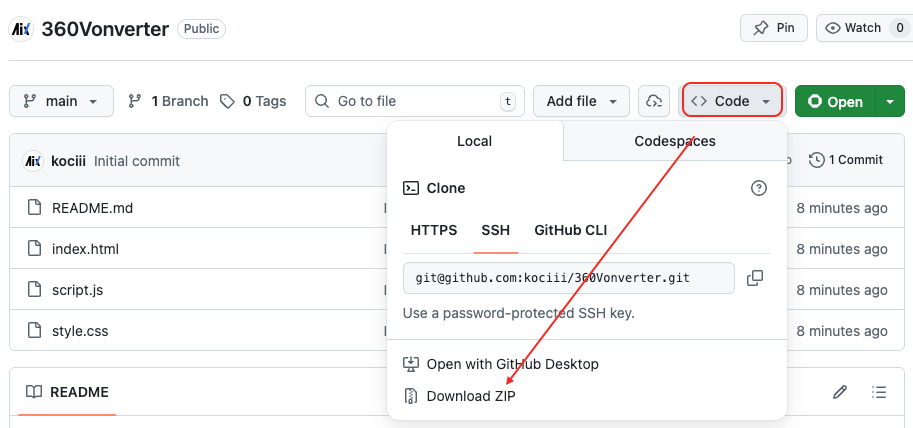

# 360° 全景图转换工具

一个基于 Web 的全景图格式转换工具，支持 **Equirectangular (2:1 全景图)** 和 **Cubemap (六面体贴图)** 之间的相互转换，并提供实时 3D 预览。



## ✨ 功能特性

### 2:1 全景图 → 六面图
- 上传一张 2:1 比例的 Equirectangular 全景图
- 自动转换为 6 张独立的 Cubemap 贴图（Right/Left/Top/Bottom/Front/Back）
- 支持导出为 ZIP 压缩包

### 六面图 → 2:1 全景图
- **批量上传**：一次选择多张图片，自动根据文件名识别对应面
- **智能识别**：支持多种命名规则
  - `right` / `left` / `top` / `bottom` / `front` / `back`
  - `px` / `nx` / `py` / `ny` / `pz` / `nz`
  - `posx` / `negx` / `posy` / `negy` / `posz` / `negz`
  - `_r` / `_l` / `_u` / `_d` / `_f` / `_b`
- **拖拽调整**：如果自动识别不准确，可以直接拖拽缩略图交换位置
- **实时预览**：调整后立即更新 3D 预览效果

### 通用特性
- 🎯 **实时 3D 预览**：支持鼠标拖拽 360° 查看全景效果
- 📐 **自动计算尺寸**：根据上传图片自动选择最佳导出分辨率
- 🔒 **本地处理**：所有转换在浏览器本地完成，无需上传服务器
- 🖼️ **缩略图预览**：上传后显示图片缩略图，支持更换

## 🚀 如何使用

### 方式一：在线使用
直接访问部署的网页即可使用。

### 方式二：本地运行
```bash
# 克隆项目
git clone git@github.com:kociii/360Vonverter.git

# 进入目录
cd 360Vonverter

# 使用本地服务器运行（推荐）
# Python 3
python -m http.server 8000

# 或使用 VS Code Live Server 插件
```
然后在浏览器访问 `http://localhost:8000`

## 📖 使用说明

### 2:1 转六面图
1. 选择「2:1 转 六面」标签
2. 点击上传区域选择一张 2:1 全景图
3. 等待图片加载完成，可在右侧预览
4. 点击「导出六面图」下载 ZIP 包

### 六面图转 2:1
1. 选择「六面 转 2:1」标签
2. **方式 A**：点击「批量选择六面图」一次上传所有图片，系统自动识别
3. **方式 B**：点击各个位置单独上传对应图片
4. 如需调整位置，直接拖拽缩略图到目标位置进行交换
5. 六张图片加载完成后，点击「导出 2:1 全景图」

## 🛠 技术栈

- **Three.js** - 3D 场景渲染与全景图预览
- **JSZip** - 打包下载转换后的六面图
- **FileSaver.js** - 文件保存
- **HTML5 Canvas** - 图像处理与转换

## 📂 项目结构

```
.
├── index.html      # 主页面
├── script.js       # 核心逻辑
├── style.css       # 样式文件
├── download.png    # 下载引导图
└── README.md       # 项目说明
```

## 📝 注意事项

- 处理高分辨率（如 8K）图片时可能需要较长时间
- 建议使用 Chrome、Firefox、Edge 或 Safari 最新版本
- 确保浏览器支持 WebGL

## 📄 License

MIT License
